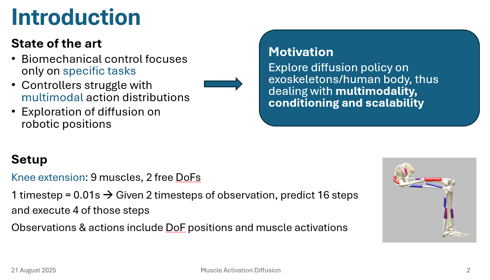
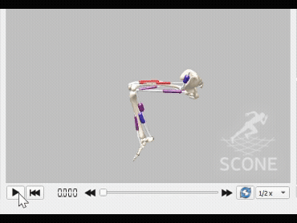
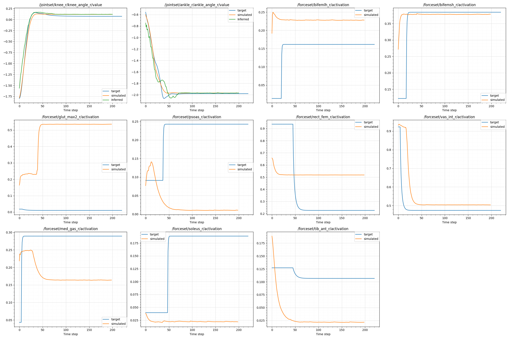

This repository contains the finished portion of a diffusion-based controller for muscle activations (unfinished code has not been included). The policy uses a feedback loop continuously re-predict and act on muscle activations in the 3D environment, generating trajectories for nonstandard actions. This repository also includes the self-developed pipeline that was used to address a lack of training data.

*Motivation and setup, taken from internal group presentation*

The research was conducted under NAIR (Neuro AI and Robotics) group of the Spanish National Research Council. All programming for this project was done in the 'code' folder. 

# Progress

**8/02/2025**

The model successfully generates muscle activations for the knee extension task with starting positions outside of training dataset and acheives **2.3% error** (Normalized RMSE) versus the expected trajectory. Hence, the diffusion policy outperforms existing controllers ([Chavarrias et al.](https://arxiv.org/abs/2503.11433)) using Reinforcement Learning and PID (proportional-integral-derivative).

The controller outputs are scripted via [Sconepy](https://scone.software/doku.php?id=sconepy) to translate into the 3D environment, such that the trajectories can be viewed on the actual human musculoskeletal system.

*Example model output*

The model was validated by comparing expected and target outputs as shown in the graphs below, focusing on the joint angles (plots titled 'jointset'). Specifically, the following outputs were compared:

- Inferred: Raw output from inference model

- Simulated: Parameters after raw (inferred) output is run through actual musculoskeletal model--adds physical realism and smoothes joint trajectories

- Target: Expected trajectory

 

Because there are countless combinations of muscle activations that result in the same  movements and joint positions, the difference in some of the activation paths is to be understood. Ultimately the valuable control output is position of the degrees of freedom--a fact well-studied by research priors in diffusion ([Chi et al.]((https://arxiv.org/abs/2303.04137)))--which the model does produce accurate results in.

**8/21/2025**

The data generation pipeline is now integrated with Pose2Sim computer vision, and thus can now work with **videos of human motion**. That is, given an unmarked video of  a real human performing complex, nonstandard full-body actions, the pipeline can obtain muscle activations which can then be fed directly to the diffusion policy--no edits to the control system required. This is the true potential of diffusion: unlike other controllers that need to be rewritten for every new task, diffusion policy is able to handle **everything under the same framework**--even complex tasks like stumbling.

A demo of the pipeline in action is shown below for a stumble. The changing colors of the muscles denote changing activations. From qualitative observation of the real and computed videos (left and right respectively), the custom computation shows a high level of matching.

This updated pipeline is shown below:

# Notes on code

##### Data Generation

Due to the scarcity of existing muscle-activation data at quantities necessary for diffusion, a pipeline to generate training data was developed by integrating SCONE/Sconepy with an OpenSim model. 

Noise modulation was included by randomizing the initial position of the model. The entire pipeline is automated such that the code creates a DataLoader object ready to be used in PyTorch, with the diffusion model.

##### Diffusion Model

A DDPM model was chosen for availability of existing documentation and good performance in existing applications

The CNN-based architecture also incorporates guided generation through FiLM conditioning, currently by observing the positional state of the musculoskeletal model. In the future, this can be modified for more complex actions such that the conditioning is based on a visual 'snapshot' of the model's position as well. In either case, the demonstrate's the control policy's **closed-loop** nature, an improvement from one-off generation that is typical of diffusion.

*Visualization of observation, action, and prediction horizons*
